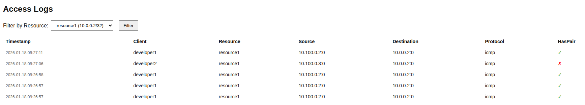
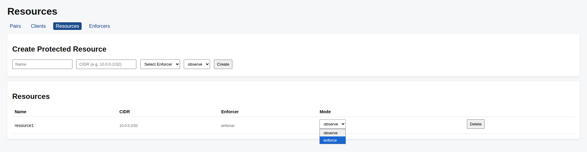

# Migration Scenario Example

This document illustrates the phased migration flow using a hypothetical customer environment.

---

## Customer Environment

Two VMs on GCP. No external IPs, accessible only via Cloud VPN.

### Target Resources
| Resource | Details |
|----------|---------|
| VPC | zt-migration-vpc |
| Subnet | zt-migration-subnet (10.0.0.0/29, IPv4 only) |
| protected-vm-1 | 10.0.0.2, Debian 12, no external IP |
| protected-vm-2 | 10.0.0.3, Debian 12, no external IP |
| Cloud VPN Gateway | zt-migration-vpn-gw (classic, IKEv2), has external IP |

```
                              +-----------------------------+
[Client] <--- Cloud VPN ----> | [VPN GW] -----> p-vm-1      |
                              |            |   (10.0.0.2)   |
                              |            |                |
                              |            +---> p-vm-2     |
                              |                (10.0.0.3)   |
                              +-----------------------------+
                                      VPC: 10.0.0.0/29
```

---

## Enforcer Implementation for This Scenario

For this example, we chose an aggregated Enforcer. We prioritized a simple configuration to clearly demonstrate the phased migration flow.

In production, consider sidecar deployment or splitting into multiple Enforcers based on trust boundaries and fault isolation requirements.

---

## Phased Migration

### Phase 0: Current State
Operating with existing VPN only. WireGuard not yet deployed.

### Phase 1: Infrastructure Setup

Create an Enforcer VM in zt-migration-subnet (10.0.0.4). Install WireGuard/nftables and enable IP forwarding.

#### 1-1. Register Enforcer in controlplane
1. UI: Enforcers → Create Enforcer
2. Example input:
   - Name: `zt-enforcer`
   - Endpoint: `<ENFORCER_PUBLIC_IP>:51820`
   - Tunnel Subnet: `10.100.0.0/24`

> **Note**: Tunnel Subnet must not overlap with VPC subnet (10.0.0.0/29). Overlap causes routing conflicts and packets won't be forwarded correctly.
3. Save the displayed API Key

#### 1-2. Start Enforcer
```bash
sudo CONTROLPLANE_URL="http://<CONTROLPLANE_IP>:8080" \
     API_KEY=<api key generated above> \
     ./enforcer
```

### Phase 2: Client Registration

#### 2-1. Register Client
```bash
# Generate public key on client side
sudo ./agent keygen
# → Save the displayed public key
```

1. UI: Clients → Create Client
2. Input:
   - Name: `developer1`
   - Username: `dev1`
   - Password: `dev1`
   - WG Public Key: `<public key generated above>`

#### 2-2. Connect from Client
```bash
sudo ./agent up \
  --cp-url http://<CONTROLPLANE_IP>:8080 \
  --username dev1 \
  --password dev1
```

### Phase 3: First Resource Migration

#### 3-1. Register Resource (observe)
1. UI: Resources → Create Resource
2. Input:
   - Name: `protected-resource1`
   - CIDR: `10.0.0.2/32`
   - Enforcer: `zt-enforcer`
   - Mode: `observe`

#### 3-2. Create Pair
1. UI: Pairs → Create Pair
2. Select Client: `developer1`, Resource: `protected-resource1`

#### 3-3. Verify Connectivity
```bash
ping -c 3 10.0.0.2 # → responds
```

#### 3-4. Verify Routing
```bash
$ sudo ./agent status
...
Resources:
  10.0.0.2/32
    wg0 ✓ (preferred)
    tun0: 10.0.0.0/29 (overlap)
...
```

- `wg0 ✓ (preferred)`: Accessed via WireGuard
- `(overlap)`: VPN has an overlapping route, but WireGuard is more specific so it takes priority

> **Note**: By Zero Trust design, WireGuard CIDRs (/32 etc.) are more specific than existing VPN, so VPN taking priority is rare. If VPN is prioritized, consider adjusting route metrics.

> **Note**: At this point, access to protected-vm-2 (10.0.0.3) continues via existing VPN. Resources not registered with WireGuard use the traditional route.

#### 3-5. Monitor and Add Pairs



Check the HasPair column in the log screen:
- ✓: Pair exists (accessible after enforce)
- ✗: No Pair (will be blocked after enforce)

In the example above, developer2 is accessing resource1 but has no Pair (✗). If we switch to enforce now, developer2 will be blocked. If this is legitimate access, create a Pair and wait until no ✗ remains before switching to enforce.

#### 3-6. Switch to enforce



Select `enforce` from the Mode dropdown. The change is reflected immediately and access control becomes active on the next Enforcer poll (within 30 seconds).

#### 3-7. Verify Operation
```bash
# developer1 (has Pair): can access
ping -c 3 10.0.0.2  # → responds

# developer2 (no Pair): blocked
ping -c 3 10.0.0.2  # → no response
```

Configuration at this point:
```
                              +-----------------------------+
[Client] <--- WireGuard ----> | [Enforcer] ----> p-vm-1     |
   ^                          | (10.0.0.4)   /  (10.0.0.2)  |
   |                          |             /               |
   +------ Cloud VPN -------> | [VPN GW] --+                |
                              |             \               |
                              |              \-> p-vm-2     |
                              |                 (10.0.0.3)  |
                              +-----------------------------+
                                      VPC: 10.0.0.0/29
```

- p-vm-1: Reachable via both WireGuard (/32) and VPN (/29). /32 takes priority
- p-vm-2: Via VPN (not yet registered with WireGuard)

### Phase 4: Subsequent Resource Migration

Repeat the same steps as Phase 3. Register protected-vm-2 (10.0.0.3/32) in observe mode, monitor logs, set up Pairs, then switch to enforce.

Configuration at this point:
```
                              +-----------------------------+
[Client] <--- WireGuard ----> | [Enforcer] -+--> p-vm-1     |
   ^                          | (10.0.0.4)  |  (10.0.0.2)   |
   |                          |             |               |
   +------ Cloud VPN -------> | [VPN GW] ---+-> p-vm-2      |
                              |                (10.0.0.3)   |
                              +-----------------------------+
                                      VPC: 10.0.0.0/29
```

- p-vm-1: Reachable via both WireGuard (/32) and VPN (/29). /32 takes priority
- p-vm-2: Reachable via both WireGuard (/32) and VPN (/29). /32 takes priority

```bash
$ sudo ./agent status
...
Resources:
  10.0.0.2/32
    wg0 ✓ (preferred)
    tun0: 10.0.0.0/29 (overlap)
  10.0.0.3/32
    wg0 ✓ (preferred)
    tun0: 10.0.0.0/29 (overlap)
...
```

### Phase 5: Migration Complete

Decommission existing VPN.

```
                              +-----------------------------+
[Client] <--- WireGuard ----> | [Enforcer] ----> p-vm-1     |
                              | (10.0.0.4)  |  (10.0.0.2)   |
                              |             |               |
                              |             +-> p-vm-2      |
                              |                (10.0.0.3)   |
                              +-----------------------------+
                                      VPC: 10.0.0.0/29
```

```bash
$ sudo ./agent status
...
Resources:
  10.0.0.2/32
    wg0 ✓ (preferred)
  10.0.0.3/32
    wg0 ✓ (preferred)
...
```

Overlap is gone, now accessing via WireGuard only.

---

## Rollback

### If Issues Occur in enforce Mode
1. UI: Change target Resource's Mode to `observe`
2. Enforcer fetches configuration on next poll (within 30 seconds)
3. All authenticated Clients can access immediately

### If Enforcer Has Issues
1. Stop agent on Client: `sudo ./agent down`
2. WireGuard routes are removed, allowing access via existing VPN (if still available)
3. After restarting Enforcer VM and running `sudo ./enforcer`, reconnect from Client once it appears to be working normally
